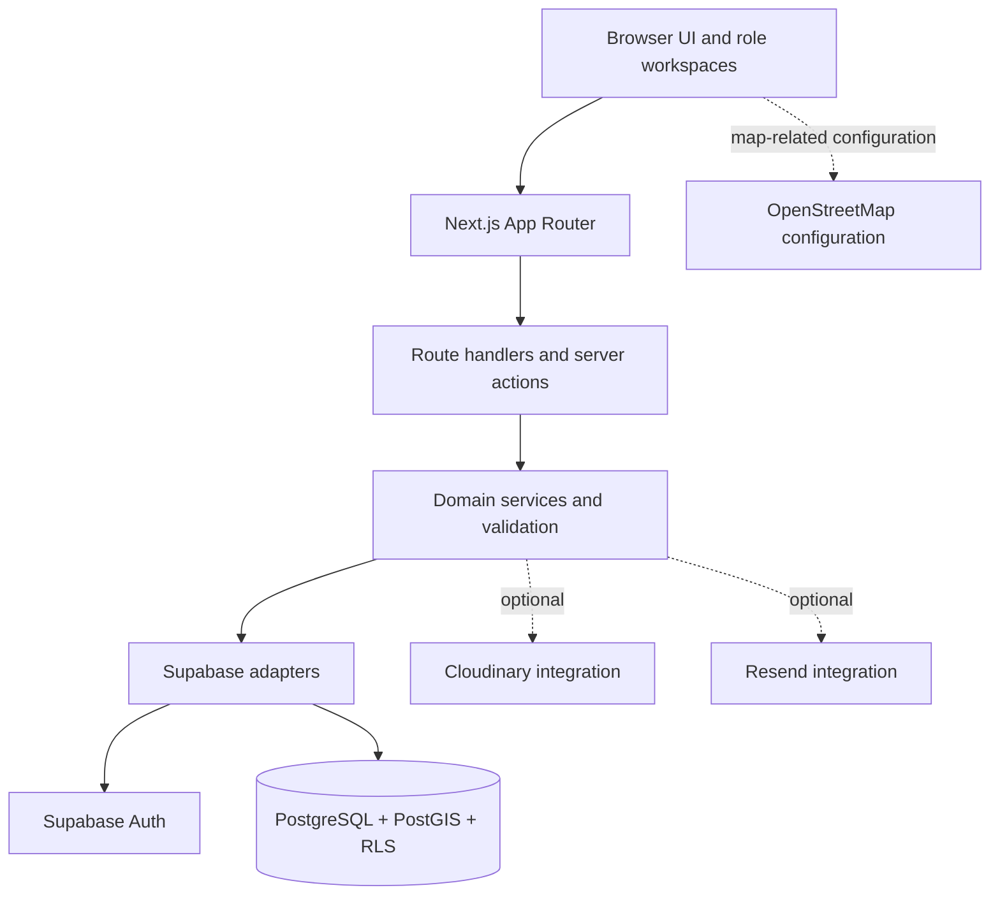

# CivicSync

**Improving Transparency and Coordination in Public Works Projects**

CivicSync is a civic-technology platform designed to improve transparency, coordination, and accountability in public works and neighbourhood-level civic services. It brings public project information, citizen observations, community-partner activities, and administrative review workflows into a shared digital experience.

The platform aims to help residents understand what is happening in their neighbourhood, help authorities review reported issues, and enable approved community groups to contribute to appropriate local activities.

> **Project status:** CivicSync is under active development. The `main` branch contains a Next.js application, Supabase/PostgreSQL data models, and selected database-backed workflows alongside demo experiences and incomplete integrations. This documentation identifies current limitations explicitly. The repository should not be treated as a production-ready municipal system until the required security, operational, and end-to-end reviews are complete.

---

## Table of Contents

1. [Problem Statement](#problem-statement)
2. [Proposed Solution](#proposed-solution)
3. [Product Objectives](#product-objectives)
4. [User Roles](#user-roles)
5. [Core Workflows and Accountability](#core-workflows-and-accountability)
6. [System Architecture](#system-architecture)
7. [Technology Stack](#technology-stack)
8. [Prerequisites](#prerequisites)
9. [Installation and Environment Configuration](#installation-and-environment-configuration)
10. [Configure Hosted Supabase Development](#configure-hosted-supabase-development)
11. [Run with Local Supabase](#run-with-local-supabase)
12. [Authentication and Demo Accounts](#authentication-and-demo-accounts)
13. [Development Commands](#development-commands)
14. [Repository Structure](#repository-structure)
15. [Database Design and Security](#database-design-and-security)
16. [Implementation Status and Known Limitations](#implementation-status-and-known-limitations)
17. [Open-Source Software and Third-Party Services](#open-source-software-and-third-party-services)
18. [Troubleshooting](#troubleshooting)
19. [Contribution Guidelines](#contribution-guidelines)
20. [Licensing](#licensing)

---

## 1. Problem Statement

### Context

Residents see roads being excavated, drains being repaired, and pipelines being installed in their neighbourhoods every day. These projects may be carried out by different municipal departments, utility providers, and contractors.

However, residents often have limited access to information about the purpose of a project, the authority responsible for it, the expected completion date, and the reasons for delays. Departments may also plan work independently, without sufficient visibility into other projects affecting the same streets.

### Problem

Information about ongoing and planned public works is scattered across offices, notice boards, departmental records, and informal communication channels. It frequently fails to reach the people most affected by construction and maintenance activities.

As a result:

- Residents cannot easily identify the purpose, schedule, or responsible authority for a project.
- Delays may occur without accessible explanations or revised timelines.
- Different departments may excavate the same road repeatedly within a short period.
- Poorly executed work and inadequate restoration may go unreported or unresolved.
- Residents lack a reliable way to follow up on observations and understand official responses.
- Authorities miss opportunities to use citizen feedback to identify problems early.

### Impact

**Public inconvenience:** Prolonged construction creates traffic congestion, access difficulties, safety hazards, and disruption to everyday life.

**Economic losses:** Residents and local businesses may face avoidable costs when projects are delayed or repeated.

**Inefficient public spending:** Duplicated excavation, repeated repairs, and poor coordination can waste materials, time, and public funds.

**Reduced accountability:** Unclear ownership and inaccessible project histories make it difficult to understand why work was delayed or whether a problem was addressed.

**Loss of public trust:** When residents cannot obtain reliable information or see how reports are handled, confidence in local institutions can decline.

---

## 2. Proposed Solution

CivicSync is intended to provide a shared transparency and coordination layer for public works and local civic issues.

The platform combines the following capabilities:

1. **Public works transparency:** Public project pages containing project details, responsible departments, timelines, locations, and status information.
2. **Neighbourhood issue reporting:** Structured reporting of potholes, damaged roads, open drains, leaks, broken streetlights, fallen trees, garbage, blocked footpaths, and other public-space issues.
3. **Community observations:** Independent observations from residents, helping distinguish a single report from an issue that multiple people have personally observed.
4. **Administrative review:** A separate official process for reviewing reports, recording decisions, requesting more information, identifying duplicates, and documenting responses.
5. **Community participation:** Work opportunities for approved community groups, including task acceptance, progress updates, completion submissions, and independent community responses.
6. **Public-works coordination:** Data structures and workflows for identifying potential scheduling conflicts and recording coordination decisions.
7. **Road restoration accountability:** Separate restoration inspection records so that the completion of construction is not automatically treated as approval of the restored road.
8. **Public access:** Stable project URLs and QR-code concepts that can make project information accessible from a work site.

CivicSync is not intended to replace a municipality's authoritative project-management, procurement, or financial systems. Its objective is to provide a transparent public-facing record and structured feedback mechanism that can complement participating authorities' processes.

---

## 3. Product Objectives

The long-term product objectives are to:

- Improve access to reliable information about public works.
- Make project timelines, responsibilities, and status changes easier to understand.
- Reduce avoidable repeat excavation through better coordination.
- Enable residents to submit structured observations and follow official review.
- Preserve the distinction between community feedback and official decisions.
- Enable approved community groups to contribute to suitable civic activities.
- Maintain an auditable history of important project, review, and task events.
- Improve the accountability of restoration work.
- Provide a foundation for future geographic analysis and participating-agency integrations.

---

## 4. User Roles

CivicSync uses three primary roles.

| Role | System value | Primary responsibilities |
|---|---|---|
| Admin | `admin` | Review civic issues, manage administrative project workflows, evaluate community-partner applications, and record authorized decisions. |
| Neighbourhood | `common` | Browse public information, report issues, provide independent observations, challenge inaccurate reports, and respond to eligible community-task completion claims. |
| Community Partners | `group` | Apply for group approval, maintain an eligible service profile, accept suitable work after approval, record progress, and submit completion claims. |

Individual and organizational sponsors use the Neighbourhood role. Sponsorship does not introduce a fourth primary role.

### Authorization principles

- Public project and approved-group information should be accessible without requiring an account wherever appropriate.
- Protected operations must verify the authenticated user on the server.
- Admin authority must be appropriately restricted; hiding a button is not sufficient authorization.
- A Community Partners account is not, by itself, evidence that a group has been approved.
- Group actions must respect group approval, membership, ownership, and permission boundaries.
- Reporter identity, private contact information, and private evidence must not be exposed through public records.

---

## 5. Core Workflows and Accountability

CivicSync deliberately separates related civic activities into independent lifecycles.

### 5.1 Public works lifecycle

Projects have their own status, including planned, active, delayed, completed, and cancelled states. Project events and coordination records provide a basis for preserving a history of work.

Project completion does **not** automatically mean that road restoration has been inspected or approved.

### 5.2 Neighbourhood issue lifecycle

A citizen issue records what was observed, where it occurred, and when the observation was made.

The current `main` branch contains a Supabase-backed issue-creation endpoint, personal-observation verification, issue challenges, and an Admin review queue when the required environment and schema are configured.

A community verification represents an independent observation. It does not establish official truth, replace administrative review, or resolve the issue.

### 5.3 Official review lifecycle

Authorized reviewers can record official decisions and reasons through the review workflow.

Community verification counts and official review status must remain distinct. A report receiving many observations does not automatically become officially accepted, and an official acceptance does not automatically mean the underlying problem has been resolved.

### 5.4 Community-partner task lifecycle

Approved community groups may accept suitable work, post progress, and submit completion claims.

Completion must remain separate from independent community confirmation and official issue resolution.

**A community task being confirmed does not automatically resolve an associated official issue.**

### 5.5 Coordination and restoration

The database model includes street segments, project-to-segment relationships, project events, coordination cases, and restoration-inspection records.

A potential project overlap should trigger review rather than automatically determine that two projects can be combined. Restoration approval requires its own inspection outcome.

### 5.6 Sponsorship

Sponsorship is currently a simulated workflow. Pledge records do not initiate payments, transfer funds, or prove that money was received.

### 5.7 Issue priority

The current Admin issue queue uses the explicit urgent-triage flag and creation time for ordering. A canonical score that combines issue severity, community observations, and unresolved age is not implemented on `main`.

---

## 6. System Architecture

CivicSync uses a layered architecture based on Next.js and Supabase.



### 6.1 Presentation layer

The `app/` and `components/` directories contain route pages, layouts, shared components, forms, and role-specific workspaces.

### 6.2 Application and API layer

Next.js route handlers and server actions handle application requests. Protected operations must authenticate, authorize, validate inputs, and delegate business rules to the appropriate service.

### 6.3 Domain layer

The `lib/domain/`, `lib/services/`, and `lib/validation/` directories contain shared data types, business logic, DTO mapping, and Zod validation schemas.

### 6.4 Supabase integration layer

The `lib/supabase/` directory contains the Supabase client adapters, including cookie-aware server access and browser-safe client configuration.

### 6.5 Persistence layer

Supabase provides authentication and access to PostgreSQL. PostGIS supports geographic data types, while row-level security (RLS), constraints, and database functions help enforce data integrity and access boundaries.

### 6.6 Optional integrations

The repository includes Cloudinary signing code for evidence uploads, optional Resend transactional email support, and an OpenStreetMap-compatible tile URL setting. These integrations are not necessarily connected end to end to every relevant screen.

### Architectural invariants

- Public DTOs must not expose private reporter information or private evidence references.
- Client-supplied identity and role values must not be trusted as authoritative.
- Suggested project matches must remain distinct from approved matches.
- Official review, independent observation, group-task confirmation, project completion, and restoration inspection must remain separate.
- Service-role keys and provider secrets must never be exposed in browser code.

---

## 7. Technology Stack

| Technology | Purpose |
|---|---|
| Next.js App Router | Routing, server-rendered pages, route handlers, and server actions |
| React | User-interface components |
| TypeScript | Static typing and shared contracts |
| Tailwind CSS 4 | Styling toolchain |
| Supabase JavaScript and `@supabase/ssr` | Authentication/session and database API integration |
| PostgreSQL | Relational persistence |
| PostGIS | Geographic data types and spatial capabilities |
| Zod | Runtime input validation |
| Framer Motion | UI animation dependency |
| Lucide React | Icons |
| next-themes | Theme support |
| qrcode.react | QR-code rendering |
| Leaflet and React Leaflet | Map library dependencies |
| Supabase CLI | Local Supabase development and migrations |
| Vitest | Automated tests |
| Playwright | Browser end-to-end tests |
| ESLint | Code linting |

The exact dependency versions are recorded in `package.json` and `package-lock.json`.

---

## 8. Prerequisites

The repository's supplied setup scripts are Windows-oriented and use PowerShell.

Required or recommended tools:

- Git
- Node.js 20.9 or later
- npm
- Docker Desktop for local Supabase development
- A Supabase project for hosted development, if using the remote setup workflow
- Access to the Supabase project settings for environment configuration

Run the following commands from the repository root unless stated otherwise.

---

## 9. Installation and Environment Configuration

### 9.1 Clone the repository

```powershell
git clone https://github.com/JeevaPN/Bits-and-Bytes.git
cd Bits-and-Bytes
```

### 9.2 Install dependencies

```powershell
npm install
```

### 9.3 Create a local environment file

```powershell
Copy-Item .env.example .env.local
```

Open `.env.local` and configure the variables appropriate to your chosen Supabase environment.

Do not commit `.env.local` or share real credentials in source files, logs, screenshots, or issue comments. The repository's `.gitignore` excludes `.env` and `.env.*` while retaining `.env.example`.

### 9.4 Environment variables

| Variable | Purpose |
|---|---|
| `NEXT_PUBLIC_SUPABASE_URL` | Supabase project URL. Required for Supabase-backed workflows. |
| `NEXT_PUBLIC_SUPABASE_ANON_KEY` | Public Supabase client key. Required for Supabase-backed workflows. |
| `NEXT_PUBLIC_SITE_URL` | Application origin, normally `http://localhost:3000` for local development. |
| `SUPABASE_SERVICE_ROLE_KEY` | Server-only key required by the demo-account provisioning step and any explicitly privileged server operation. Never expose it to the browser. |
| `CIVICSYNC_REMOTE_PROJECT_REF` | Verified, non-secret project reference required for hosted development setup. Must match the URL and CLI link. |
| `CIVICSYNC_REMOTE_TARGET` | Development-target classification used by the remote setup safety checks. |
| `NEXT_PUBLIC_OSM_TILE_URL` | Optional OpenStreetMap-compatible tile URL template. Does not itself provide routing or geocoding. |
| `CLOUDINARY_CLOUD_NAME` | Optional Cloudinary configuration. |
| `CLOUDINARY_API_KEY` | Optional Cloudinary key used for signed upload setup. |
| `CLOUDINARY_API_SECRET` | Server-only Cloudinary secret. Never expose it to the browser. |
| `RESEND_API_KEY` | Optional server-only key for transactional email. |
| `RESEND_FROM_EMAIL` | Sender address for configured transactional email. |
| `CIVICSYNC_DEMO_PASSWORD` | Optional demo-account password configuration; see the setup scripts before overriding it. |

Example for a hosted **development** project:

```dotenv
NEXT_PUBLIC_SUPABASE_URL=https://YOUR_PROJECT_REF.supabase.co
NEXT_PUBLIC_SUPABASE_ANON_KEY=YOUR_SUPABASE_ANON_KEY
NEXT_PUBLIC_SITE_URL=http://localhost:3000
CIVICSYNC_REMOTE_PROJECT_REF=YOUR_PROJECT_REF
SUPABASE_SERVICE_ROLE_KEY=YOUR_SERVER_ONLY_SERVICE_ROLE_KEY
```

Replace placeholders with values from the same development project. Never commit real values.

---

## 10. Configure Hosted Supabase Development

> **Warning:** This workflow modifies the linked hosted database. Use a dedicated development or test project only. Never run it against production or a project containing irreplaceable data.

### Step 1 — Create or select a development project

Create a dedicated Supabase project and retrieve its project URL, public client key, server-only service-role key, and project reference.

### Step 2 — Configure `.env.local`

Set the Supabase URL, public client key, service-role key, and verified `CIVICSYNC_REMOTE_PROJECT_REF`.

The reference must match the project reference in the configured Supabase URL.

### Step 3 — Authenticate the Supabase CLI

Open PowerShell at the repository root:

```powershell
npx.cmd --no-install supabase login
```

### Step 4 — Link the verified project

```powershell
npx.cmd --no-install supabase link --project-ref YOUR_PROJECT_REF
```

Replace `YOUR_PROJECT_REF` with the actual reference from the Supabase dashboard.

### Step 5 — Review migration history

Before using an existing remote project, read [docs/MIGRATIONS.md](docs/MIGRATIONS.md).

The repository's migration filenames have been normalized into an ordered sequence. A hosted project created from earlier filenames may have a different migration history. Reconcile that history through the documented procedure; do not blindly rename remote migration-history records or force a schema repair.

### Step 6 — Run the remote development setup

```powershell
npm run dev:setup:remote
```

The setup script performs environment preflight checks, verifies the configured URL and CLI link against the expected project reference, applies pending migrations, runs `supabase/verify.sql`, applies the deterministic development seed, ensures demo Auth accounts exist, and starts Next.js.

If a safety check fails, correct the project configuration rather than bypassing the check.

**Important:** This script applies database changes and seed data. Its safety checks reduce the risk of selecting the wrong project; they do not make production use safe.

---

## 11. Run with Local Supabase

Local development requires Docker Desktop.

### Step 1 — Start local Supabase

```powershell
npx.cmd --no-install supabase start
```

Use the CLI output to identify the local API URL, anon key, and service-role key.

### Step 2 — Configure `.env.local`

Set the values for your local Supabase instance. The default local API URL is normally:

```dotenv
NEXT_PUBLIC_SUPABASE_URL=http://127.0.0.1:54321
NEXT_PUBLIC_SUPABASE_ANON_KEY=YOUR_LOCAL_ANON_KEY
NEXT_PUBLIC_SITE_URL=http://localhost:3000
SUPABASE_SERVICE_ROLE_KEY=YOUR_LOCAL_SERVICE_ROLE_KEY
```

Use the actual keys printed by your local CLI; do not copy hosted credentials into a local setup unintentionally.

### Step 3 — Run the complete setup

```powershell
npm run dev:setup
```

This workflow initializes or verifies the local Supabase environment, applies migrations, verifies the schema, loads deterministic development data, provisions missing demo accounts, and starts the application.

### Step 4 — Open CivicSync

Visit:

**http://localhost:3000**

For subsequent development sessions, run:

```powershell
npm run dev
```

The normal development command does not automatically migrate or seed the database.

The development-server wrapper also prevents duplicate CivicSync processes from sharing the same Next.js build directory.

---

## 12. Authentication and Demo Accounts

CivicSync uses Supabase Auth for email-and-password authentication.

The development authentication guide recommends disabling email confirmation for a dedicated development project when developers need to test signup without configuring email delivery:

**Supabase Dashboard → Authentication → Providers → Email → Confirm email**

This is a development convenience, not a production recommendation. Before a public pilot, configure reliable authentication email delivery and an appropriate verified-email policy.

Additional rules:

- Public signup should not allow users to grant themselves Admin privileges.
- Admin access must be provisioned through a trusted staff or development workflow.
- Selecting the Community Partners role does not approve a group.
- The full development setup requires `SUPABASE_SERVICE_ROLE_KEY` to provision missing demo accounts.
- Generated demo credentials are stored in `.cache/demo-accounts.json`, which is ignored by Git. Treat this file as sensitive.
- Demo accounts and seeded records are for development only. Do not reuse demo credentials for real users.

Refer to [docs/AUTH_DEVELOPMENT.md](docs/AUTH_DEVELOPMENT.md) and [docs/DEV_SETUP.md](docs/DEV_SETUP.md) for the detailed setup behaviour.

---

## 13. Development Commands

| Command | Description |
|---|---|
| `npm run dev` | Start Next.js without applying migrations or seed data. |
| `npm run dev:setup` | Full local Supabase setup, migration, verification, seed, demo-account provisioning, and app startup. |
| `npm run dev:setup:remote` | Full setup against a verified hosted development project. Modifies the remote database. |
| `npm run dev:verify` | Run environment preflight and check the application health endpoint. |
| `npm run db:migrate` | Apply migrations using the repository's PowerShell wrapper. |
| `npm run dev:seed` | Apply deterministic development seed data. |
| `npm run dev:reset -- -ConfirmReset` | Reset local development data. This is destructive; remote reset is refused by the script. |
| `npm run lint` | Run ESLint. |
| `npm run typecheck` | Run TypeScript checks without emitting output. |
| `npm run test` | Run the Vitest test suite. |
| `npm run test:watch` | Run Vitest in watch mode. |
| `npm run test:e2e` | Run Playwright end-to-end tests. |
| `npm run build` | Build the application for production. |
| `npm run validate:migrations` | Validate migration filenames/order and reject empty files. |
| `npm run generate:traceability` | Regenerate feature traceability artefacts. |
| `npm run validate:traceability` | Validate feature traceability data. |

Suggested pre-review checks:

```powershell
npm run lint
npm run typecheck
npm run test
npm run validate:migrations
npm run validate:traceability
npm run build
```

A passing static check does not prove that every database migration executes correctly or that RLS behaves as intended. Changes to database workflows must also be tested against a local or disposable Supabase environment.

### Health check

After starting the application, visit:

`http://localhost:3000/api/health`

Or run:

```powershell
npm run dev:verify
```

The health endpoint checks environment configuration, database access, and required read-model relations. A degraded status or HTTP 503 indicates that configuration or database requirements need attention.

---

## 14. Repository Structure

```text
Bits-and-Bytes/
├── app/
│   ├── admin/                   # Administrative workspace and review workflows
│   ├── api/                     # API route handlers and health checks
│   ├── auth/                    # Authentication routes
│   ├── community-partners/      # Partner directory, applications, and tasks
│   ├── neighbourhood/           # Neighbourhood workspace and issue reporting
│   ├── projects/                # Public project pages
│   ├── map/                     # Map/demo preview
│   └── sponsorship/             # Simulated sponsorship experience
├── components/                  # Shared and feature-specific UI
├── lib/
│   ├── auth/                    # Authorization and workspace helpers
│   ├── config/                  # Environment diagnostics
│   ├── domain/                  # Types, statuses, and demo fixtures
│   ├── email/                   # Optional transactional-email adapter
│   ├── media/                   # Cloudinary signing helper
│   ├── services/                # Domain services and data workflows
│   ├── supabase/                # Supabase browser/server adapters
│   └── validation/              # Zod schemas
├── scripts/                     # Setup, migration, seed, and verification scripts
├── supabase/
│   ├── migrations/              # Ordered SQL migrations
│   ├── seed.sql                 # Deterministic development fixtures
│   ├── verify.sql               # Schema/read-model verification
│   └── config.toml              # Local Supabase configuration
├── tests/                       # Automated tests
├── docs/                        # Architecture, setup, contracts, and handoffs
├── .env.example                 # Environment-variable template
└── package.json                 # Dependencies and scripts
```

### Additional documentation

- [Architecture](docs/ARCHITECTURE.md)
- [Data model](docs/DATA_MODEL.md)
- [Development setup](docs/DEV_SETUP.md)
- [Authentication development](docs/AUTH_DEVELOPMENT.md)
- [Migration procedure](docs/MIGRATIONS.md)
- [Project structure](docs/PROJECT_STRUCTURE.md)
- [Team contracts](docs/TEAM_CONTRACTS.md)
- [Feature checklist](docs/FEATURE_CHECKLIST.md)

---

## 15. Database Design and Security

### Database design

The core migration defines relational and geospatial records, including:

- `profiles` and `admin_scopes` for identity and administrative scope data.
- `social_groups` and `group_members` for community-partner profiles, approval, and membership.
- `street_segments`, `projects`, and `project_segments` for public works and affected streets.
- `project_events` and `coordination_cases` for history and coordination.
- `issues`, `issue_verifications`, `issue_project_matches`, and `official_reviews` for citizen observations and administrative review.
- `group_tasks`, task events, and task confirmations for community work.
- `sponsorship_campaigns` and `sponsorship_pledges` for the simulated sponsorship lifecycle.
- `project_follows` for project-following functionality.

PostGIS geographic types support location data. Constraints and indexes support data integrity and common lookups. Subsequent migrations add workflows, policies, read models, and supporting database functions.

### Migration practices

- Treat `supabase/migrations/` as the authoritative schema history.
- Apply migrations in the documented order.
- Review [docs/MIGRATIONS.md](docs/MIGRATIONS.md) before updating an existing hosted project.
- Do not manually edit hosted schemas or migration-history records to bypass an error.
- Use `supabase/seed.sql` only for development fixtures.
- Understand that `npm run validate:migrations` performs static filename/order validation, not a PostgreSQL execution test.

### Security and privacy

Before a production pilot:

1. Review every RLS policy and database grant.
2. Test access using anonymous, Neighbourhood, Community Partner, and Admin identities.
3. Verify session identity, ownership, group approval, and membership on protected server operations.
4. Enforce administrative department and jurisdiction boundaries.
5. Protect private evidence and prevent leakage through public DTOs.
6. Configure appropriate session controls, rate limits, abuse prevention, audit logs, backups, and recovery procedures.
7. Keep all service-role and provider secrets server-side.

**Known limitation:** The `admin_scopes` table exists, but the current Admin workflows do not fully enforce department and jurisdiction boundaries. Do not assume that different Admin accounts are already restricted to different departments or geographic areas.

---

## 16. Implementation Status and Known Limitations

CivicSync combines persisted workflows with demo pages and incomplete integrations. The following distinctions are important.

| Area | Status on `main` |
|---|---|
| Supabase schema | Core entities, policies, and read models are defined through migrations. Target databases must be migrated and verified. |
| Authentication | Supabase Auth and role-aware navigation are present. Production email verification and trusted staff provisioning require further configuration and review. |
| Issue reporting | Validated report fields can be submitted through a server endpoint and persisted when Supabase is configured correctly. |
| Community verification and challenges | Server-backed flows exist. Community observations remain distinct from official decisions. |
| Admin issue review | A persisted review queue and server-side review actions are present. |
| Community-partner workflows | Application, membership, task, progress, and completion/confirmation workflows are represented in the codebase. Validate the complete lifecycle and RLS behaviour in the target environment. |
| Public project pages | Project and QR-code concepts exist; demo/fixture behaviour remains. Review public URLs before deployment. |
| Map | The current map is a static/demo preview. It is not a complete live mapping, geocoding, routing, or traffic integration. |
| Coordination and restoration | Data models and administrative workflow components exist. End-to-end operational validation with real agencies and road data remains necessary. |
| Issue evidence upload | The report form has a photo picker and Cloudinary signing helper exists, but the report form does not currently upload and attach the selected file end to end. |
| Dynamic issue priority | The current Admin queue uses the urgent flag and creation time. Age-based escalation and the proposed severity/verification/age score are not implemented on `main`. |
| Sponsorship | Simulated campaign and pledge behaviour only; no real payments. |
| Email | Optional Resend transactional-email configuration exists. Supabase Auth email delivery is configured separately. |
| Government, traffic, and routing integrations | No live municipal, traffic, or road-routing integration is implemented. |

### Production-readiness checklist

Before a public pilot, the team should:

- Complete a security and permissions review, including Admin scope enforcement.
- Test the migration chain and RLS policies against a disposable Supabase project.
- Complete and test private/public evidence upload, access, retention, and deletion.
- Replace or clearly label demo records and placeholder links.
- Configure production authentication, email delivery, domains, monitoring, backups, and recovery.
- Validate external integrations only when appropriate data and provider permissions are available.
- Keep sponsorship clearly simulated unless a separately reviewed payment provider and compliance process are implemented.

---

## 17. Open-Source Software and Third-Party Services

CivicSync uses the following open-source libraries and tools. Exact versions are recorded in `package-lock.json`. Review the licence for each installed version and preserve applicable notices when distributing the application.

| Project | Purpose | Upstream resource |
|---|---|---|
| Next.js | Application framework | https://github.com/vercel/next.js |
| React | UI rendering | https://github.com/facebook/react |
| TypeScript | Static typing | https://github.com/microsoft/TypeScript |
| Tailwind CSS | Styling toolchain | https://github.com/tailwindlabs/tailwindcss |
| Supabase JavaScript | Supabase API client | https://github.com/supabase/supabase-js |
| Supabase SSR | Cookie-aware server sessions | https://github.com/supabase/ssr |
| PostgreSQL | Relational database | https://www.postgresql.org/ |
| PostGIS | Geospatial database capabilities | https://postgis.net/ |
| Zod | Runtime validation | https://github.com/colinhacks/zod |
| Framer Motion | UI animation | https://github.com/motiondivision/motion |
| Lucide React | Icon library | https://github.com/lucide-icons/lucide |
| next-themes | Theme handling | https://github.com/pacocoursey/next-themes |
| qrcode.react | QR-code rendering | https://github.com/zpao/qrcode.react |
| Leaflet | Map library | https://leafletjs.com/ |
| React Leaflet | React integration for Leaflet | https://react-leaflet.js.org/ |
| Supabase CLI | Local Supabase and migrations | https://github.com/supabase/cli |
| Vitest | Automated tests | https://github.com/vitest-dev/vitest |
| Playwright | Browser end-to-end tests | https://github.com/microsoft/playwright |
| ESLint | Code linting | https://github.com/eslint/eslint |

### Third-party services and data

**Supabase:** Provides hosted authentication, database access, and related backend services when configured. A local development stack is supported by the Supabase CLI.

**Cloudinary:** Optional external media service. The current code includes signed-upload support, but the Neighbourhood report form is not connected to a complete evidence-upload workflow.

**Resend:** Optional transactional email service. Supabase Auth email delivery is configured separately.

**OpenStreetMap:** The environment template includes an optional tile URL. The current map is a demo preview, not a complete live OSM implementation. If OSM tiles are displayed, preserve visible attribution and comply with the [OpenStreetMap copyright and attribution requirements](https://www.openstreetmap.org/copyright) and [tile usage policy](https://operations.osmfoundation.org/policies/tiles/).

The public OSM tile service should not be treated as an unrestricted production tile CDN.

The use of a third-party service does not imply that the service itself is open source or that its hosted offering is free of usage restrictions.

---

## 18. Troubleshooting

### Remote setup refuses to continue

Check that `NEXT_PUBLIC_SUPABASE_URL`, `CIVICSYNC_REMOTE_PROJECT_REF`, and the project linked through the Supabase CLI all identify the same dedicated development project.

Do not bypass a mismatch by changing environment values without verifying the actual target.

### Demo-account provisioning fails

The account-provisioning step requires a valid `SUPABASE_SERVICE_ROLE_KEY` for the same project. Keep it server-side.

If migrations or seeding completed before the account step failed, inspect the terminal output and health endpoint before rerunning. Do not assume the complete setup operation rolled back.

### The health endpoint returns HTTP 503

Verify the environment variables, database connectivity, migration status, and required read-model relations. Inspect the JSON response from `/api/health` and the development-server output.

### The development server says CivicSync is already running

The `npm run dev` wrapper prevents duplicate processes from sharing the Next.js build directory.

Return to the terminal running CivicSync and stop it with `Ctrl+C`. Ensure that no previous Node.js/Next.js process remains before removing any stale lock or cache files.

### Migration history differs from the repository

Stop and consult [docs/MIGRATIONS.md](docs/MIGRATIONS.md). Compare the hosted migration history with the repository's ordered SQL files and use a reviewed reconciliation approach.

Do not blindly delete migration records, rename hosted migration-history entries, reset a hosted database, or rerun schema SQL manually.

### A report photo appears selected but is not saved

The current report form does not upload the selected file to Cloudinary and attach it to the issue end to end. Selecting a file does not mean that evidence was stored. Treat evidence upload as incomplete until the full flow is implemented and tested.

---

## 19. Contribution Guidelines

Contributors should follow these principles:

1. Read the architecture, data model, and feature checklist before implementing a cross-role workflow.
2. Preserve shared role names, status definitions, API contracts, and lifecycle boundaries.
3. Implement protected operations through server-side handlers or actions with authentication, authorization, and validation.
4. Apply database RLS policies and test both permitted and denied operations.
5. Keep demo data explicitly identifiable and never silently treat an in-memory mock as production persistence.
6. Add automated tests for ownership, role boundaries, group approval, privacy, and lifecycle separation.
7. Coordinate changes to shared contracts, database migrations, global layouts, and services with affected contributors.
8. Run lint, type checking, tests, migration validation, traceability validation, and a production build before submitting changes.
9. Update the relevant documentation and feature traceability when behaviour or implementation status changes.

---

## 20. Licensing

At the time this README was prepared, the `main` branch did not contain a top-level `LICENSE` file.

Accordingly, the CivicSync repository itself should **not be assumed to have been released under an open-source licence**. The project maintainers should select and add an appropriate licence before inviting external reuse or accepting contributions under a declared licence.

Third-party libraries and services remain subject to their own licences, terms, and attribution requirements.

---

**CivicSync — Making public works more visible, coordinated, and accountable.**