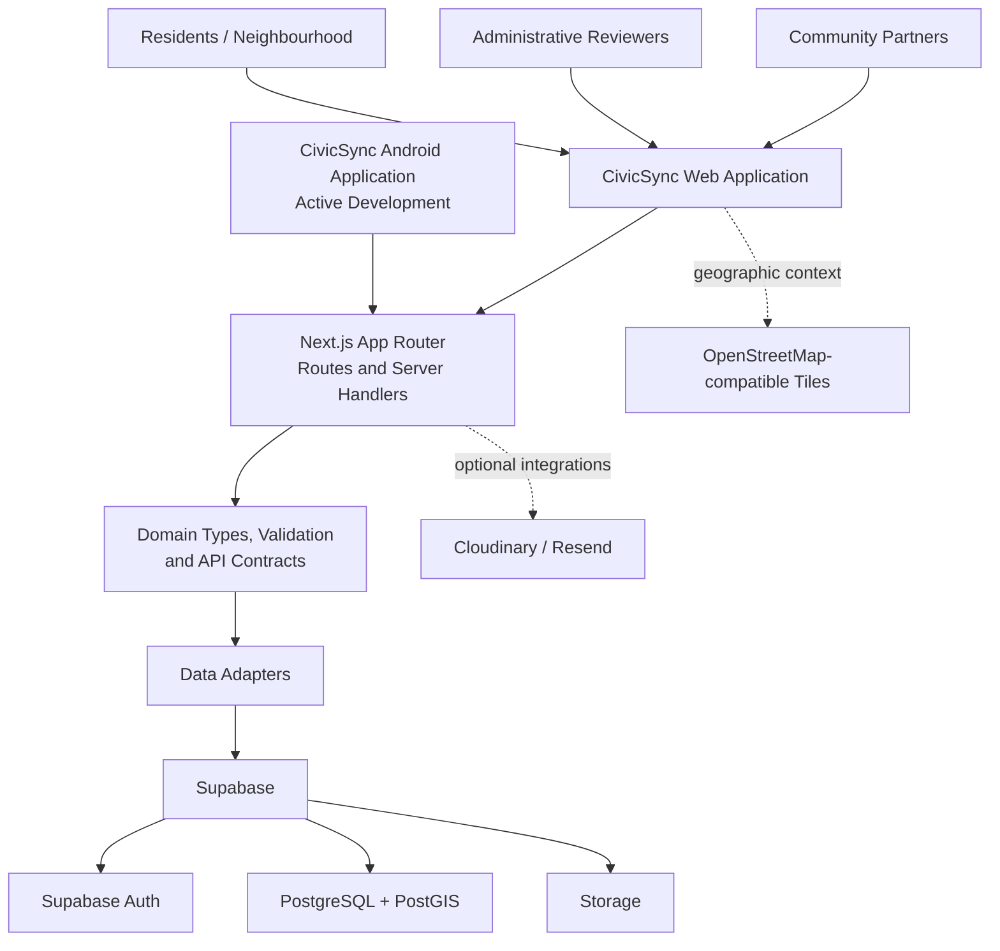

# CivicSync
### Improving Transparency, Coordination, and Accountability in Public Works

**CivicSync is a civic-technology platform that connects residents, public-work information, administrative review, and community participation in one coordinated experience.** It helps make neighbourhood infrastructure work easier to understand, civic issues easier to report and follow, and community action easier to organize.

<p align="center">
  <a href="https://bits-and-bytes-kappa.vercel.app/neighbourhood"><strong>🌐 Explore the Live Web Application</strong></a>
  &nbsp; · &nbsp;
  <a href="https://github.com/JeevaPN/Bits-and-Bytes"><strong>📂 View Source Code</strong></a>
</p>

> **Project status:** The web application is deployed on Vercel. Development of the companion Android application is actively underway as part of the same CivicSync initiative.

---

## Table of Contents

- [The Problem](#the-problem)
- [Our Solution](#our-solution)
- [Project Goals](#project-goals)
- [Platform Highlights](#platform-highlights)
- [How CivicSync Works](#how-civicsync-works)
- [Architecture](#architecture)
- [Technology Stack](#technology-stack)
- [Live Web Application](#live-web-application)
- [Android Application](#android-application)
- [Getting Started](#getting-started)
- [Environment Configuration](#environment-configuration)
- [Supabase Setup](#supabase-setup)
- [Development Commands](#development-commands)
- [Project Structure](#project-structure)
- [Open-Source Credits and External Services](#open-source-credits-and-external-services)
- [Responsible Use and Data Transparency](#responsible-use-and-data-transparency)

---

## The Problem

Public infrastructure is essential to everyday life, yet information about public works is often fragmented across departments, contractors, notices, and local communication channels.

Residents may see a road being excavated, a drain being repaired, or a pipeline being replaced without knowing **why the work is happening, who is responsible, when it is expected to finish, or where to raise a concern**. When multiple agencies work on the same street without coordination, infrastructure may be disturbed repeatedly. Delays and unresolved local issues can be difficult for residents to track, while officials and community organizations may lack one shared view of local needs.

These information gaps create real consequences: traffic disruption, safety risks, inconvenience to households and businesses, avoidable repeat work, and reduced trust in civic processes. They also limit opportunities for residents to provide useful local observations and participate constructively in neighbourhood improvement.

## Our Solution

CivicSync brings the public-facing picture of infrastructure work and neighbourhood issues into a single, structured digital experience. It is designed around three connected participant groups:

- **Residents and neighbourhood members** can explore public works, report local issues, contribute observations, and follow civic activity.
- **Administrative reviewers** can review reported issues, manage public-work information, record decisions, and oversee coordination and restoration workflows.
- **Community partners** can discover suitable opportunities and organize community-led work with documented progress and confirmation.

By making information easier to find and civic workflows easier to follow, CivicSync aims to support better coordination, meaningful participation, and clearer accountability.

## Project Goals

1. **Improve transparency** — make public works, schedules, responsible entities, and status information easier to understand.
2. **Support earlier community reporting** — give residents a structured way to document neighbourhood issues and share observations.
3. **Encourage coordination** — help surface potential conflicts when several works relate to the same place or street segment.
4. **Strengthen accountability** — create clearer records of reviews, decisions, progress, and follow-up.
5. **Enable community participation** — give community groups a structured path to engage with appropriate civic tasks.
6. **Keep civic status meaningful** — distinguish community observations from official decisions and completion from independent restoration checks.
7. **Build for web and mobile access** — deliver a deployed web experience while extending the project through active Android development.

## Platform Highlights

### Public works transparency

A public-facing project experience is designed to communicate the purpose, location, responsible department, expected dates, status, and relevant updates for infrastructure work. Public project pages and QR-code destinations make it easier to return to information about a particular work.

### Neighbourhood issue reporting

Residents can use a structured reporting flow to describe a local issue, select a category, provide location details, and contribute observations. Community verification is treated as a separate signal from an official administrative review.

### Administrative review

The Admin workspace brings together project and issue review surfaces, helping administrative users organize decisions, provide responses, and manage follow-up. The underlying model supports role-oriented access and scope-aware administration.

### Community partner participation

The Community Partners workspace presents community organizations and suitable opportunities for neighbourhood action. Task records and activity history are designed to make ownership, progress, and completion review easier to follow.

### Coordination and restoration

CivicSync's data model supports coordination cases for potentially conflicting work, together with distinct project-completion and restoration-inspection concepts. This helps avoid treating the end of construction as proof that a public space has been properly restored.

### Shared civic context

Map-oriented data, location fields, project records, issue reports, and public status information provide a common geographic context for residents, reviewers, and community partners.

## How CivicSync Works

The platform separates three related but independent workflows so that each status communicates the right kind of progress.

### 1. Public works lifecycle

**Plan → Review → Publish → Execute → Complete → Inspect / Restore**

Public works have their own record, schedule, event history, and restoration context. A completion status and a restoration approval represent different outcomes.

### 2. Neighbourhood issue lifecycle

**Observe → Community Verification → Official Review → Response / Referral → Remediation → Resolution or Reopening**

Community observations can help provide context, while official review remains a separate administrative action. This supports a clear distinction between what residents report and what an authorized reviewer decides.

### 3. Community task lifecycle

**Discover → Accept → Work → Document Progress → Submit Completion → Independent Confirmation or Dispute**

Community partners can take part in suitable work while progress and completion remain reviewable. A community task’s completion is not automatically treated as official resolution of the related issue.

These distinctions help CivicSync provide a more reliable picture of civic activity without collapsing different kinds of evidence or responsibility into a single status.

## Architecture

CivicSync uses a modular Next.js application with role-oriented routes, shared domain contracts, validation, server endpoints, and a Supabase data layer. The web and Android experiences are part of the same product direction, with shared civic workflows and backend integration as key architectural goals.



### Architectural principles

- **Role-oriented workspaces:** Admin, Neighbourhood, and Community Partners have distinct entry points and responsibilities.
- **Shared contracts:** common types and API contracts help separate interface work from backend integration.
- **Validation at boundaries:** report inputs and structured data are validated before being used by domain logic.
- **Data protection:** service-role credentials are server-only; public responses should expose only information intended for public use.
- **Geographic context:** PostgreSQL/PostGIS supports location-aware civic records and spatial indexing.
- **Independent workflows:** public works, civic issues, community tasks, and restoration retain their own lifecycle and decision points.

## Technology Stack

| Area | Technologies |
|---|---|
| Web framework | Next.js 15, React 19 |
| Language | TypeScript |
| Styling | Tailwind CSS 4 |
| Authentication and data services | Supabase JS, Supabase SSR |
| Database and geospatial data | PostgreSQL, PostGIS |
| Input validation | Zod |
| Motion and interface icons | Framer Motion, Lucide React |
| Appearance preferences | next-themes |
| QR codes | qrcode.react |
| Map components | Leaflet, React Leaflet |
| Email integration | Resend (configuration-based) |
| Evidence upload integration | Cloudinary (configuration-based) |
| Hosting | Vercel |
| Testing and quality tools | Vitest, Playwright, ESLint, TypeScript |
| Database development tooling | Supabase CLI |

## Live Web Application

The CivicSync web application is deployed on Vercel and provides the current public entry point for evaluation.

**[Open CivicSync — Neighbourhood Workspace](https://bits-and-bytes-kappa.vercel.app/neighbourhood)**

The live application is the quickest way to explore the current web experience. Individual screens and workflows continue to evolve alongside the project.

## Android Application

**Android development is actively in progress for the same CivicSync project.**

The mobile application is being developed to extend CivicSync’s civic reporting and participation experience beyond the browser. The shared product direction is to keep the web and Android experiences consistent in their civic workflows, data concepts, and permissions as mobile development and backend integration progress.

The Android application is part of the ongoing project, rather than a separate product. Platform-specific implementation and release information will be added as the mobile application reaches its next milestones.

## Getting Started

### Prerequisites

- **Node.js 20.9 or newer**
- npm
- Git
- A Supabase project, or Docker Desktop for a local Supabase instance
- Windows PowerShell for the repository’s automated development setup scripts

### 1. Clone the repository

```powershell
git clone https://github.com/JeevaPN/Bits-and-Bytes.git
cd Bits-and-Bytes
```

### 2. Install dependencies

```powershell
npm install
```

### 3. Create the local environment file

```powershell
Copy-Item .env.example .env.local
```

Open `.env.local` and fill in the configuration needed for your selected Supabase setup. See [Environment Configuration](#environment-configuration).

### 4. Connect Supabase and prepare the development environment

For a **dedicated Supabase development project**, use the hosted setup steps below. For local development with Docker, follow [Local Supabase setup](#option-b-local-supabase-with-docker).

#### Option A — Hosted Supabase development project

1. Create or select a dedicated development project in the [Supabase Dashboard](https://supabase.com/dashboard).
2. Copy its project URL, anon key, service-role key, and project reference into the relevant environment settings.
3. Run the following commands in PowerShell:

```powershell
npx.cmd --no-install supabase login
npx.cmd --no-install supabase link --project-ref YOUR_PROJECT_REF
npm run dev:setup:remote
```

Replace `YOUR_PROJECT_REF` with the project reference shown in the Supabase Dashboard. Ensure `CIVICSYNC_REMOTE_PROJECT_REF` in `.env.local` matches that reference and `CIVICSYNC_REMOTE_TARGET=development`.

The remote setup command applies the repository migrations to the **linked development database**, verifies the schema, seeds development data, initializes demo accounts, and starts the application. Use a dedicated development/test project: this command changes the linked database.

#### Option B — Local Supabase with Docker

1. Install and start [Docker Desktop](https://www.docker.com/products/docker-desktop/).
2. Start the local Supabase services:

```powershell
npx.cmd --no-install supabase start
```

3. Copy the local API URL and keys printed by the Supabase CLI into `.env.local`. The local URL is normally `http://127.0.0.1:54321`. Use the **local** anon key and service-role key printed by the CLI, not credentials from a hosted project.
4. Confirm that `NEXT_PUBLIC_SUPABASE_URL` points to the local URL, then run:

```powershell
npm run dev:setup
```

The local setup command applies migrations, verifies the schema, seeds development data, initializes demo accounts, and starts the app.

### 5. Open CivicSync

When setup is complete, open:

- **Application:** <http://localhost:3000>
- **Health check:** <http://localhost:3000/api/health>

For later development sessions, start the web application with:

```powershell
npm run dev
```

## Environment Configuration

The repository includes an `.env.example` template. Copy it to `.env.local` and configure only the services you intend to use.

| Variable | Purpose |
|---|---|
| `NEXT_PUBLIC_SUPABASE_URL` | Supabase project URL used by the application |
| `NEXT_PUBLIC_SUPABASE_ANON_KEY` | Supabase anon/publishable client key used by the application |
| `NEXT_PUBLIC_SITE_URL` | Base site URL; use `http://localhost:3000` for local development |
| `SUPABASE_SERVICE_ROLE_KEY` | Server-only privileged Supabase key used by development account initialization or authorized server operations |
| `CIVICSYNC_REMOTE_TARGET` | Explicit target guard for hosted development setup; use `development` only with a dedicated development project |
| `CIVICSYNC_REMOTE_PROJECT_REF` | Supabase project reference used to verify the intended linked project |
| `NEXT_PUBLIC_OSM_TILE_URL` | Optional OpenStreetMap-compatible tile URL template; the example file provides a default |
| `CLOUDINARY_CLOUD_NAME` | Cloudinary account name for signed evidence-upload integration |
| `CLOUDINARY_API_KEY` | Cloudinary API key |
| `CLOUDINARY_API_SECRET` | Server-only Cloudinary API secret |
| `RESEND_API_KEY` | Server-only Resend key for configured email notifications |
| `RESEND_FROM_EMAIL` | Verified sender address for configured email notifications |
| `CIVICSYNC_DEMO_PASSWORD` | Development password used when the setup script initializes demo accounts |

### Keep credentials safe

- Never commit `.env.local`, API secrets, service-role keys, or real credentials.
- Variables prefixed with `NEXT_PUBLIC_` are intended to be exposed to the browser; **never** put a secret in one.
- Keep `SUPABASE_SERVICE_ROLE_KEY` and the Cloudinary API secret server-side.
- Use separate credentials and infrastructure for development and production.

## Supabase Setup

The initial database migration is located at:

`supabase/migrations/202610100001_core.sql`

It establishes the core data model for user profiles and roles, administrative scopes, community groups and memberships, street segments, public works projects and event history, coordination cases, neighbourhood issues, community verifications, official reviews, issue-project matches, community tasks and confirmations, sponsorship campaigns, and project follows. PostGIS is enabled for geographic data and spatial indexes.

The development setup scripts apply migrations and run schema verification before seeding the configured development environment. Use the Supabase Dashboard to confirm your project's Auth URL settings and credentials.

## Development Commands

| Command | Purpose |
|---|---|
| `npm run dev` | Start the Next.js development server |
| `npm run dev:setup` | Prepare local Supabase, migrate, verify, seed, initialize demo accounts, and start the app |
| `npm run dev:setup:remote` | Prepare a linked **development** Supabase project, migrate, verify, seed, initialize demo accounts, and start the app |
| `npm run dev:verify` | Run development environment diagnostics |
| `npm run db:migrate` | Apply database migrations through the project script |
| `npm run dev:seed` | Seed development data |
| `npm run dev:reset -- -ConfirmReset` | Reset development data with explicit confirmation |
| `npm run lint` | Run ESLint |
| `npm run typecheck` | Run the TypeScript type checker |
| `npm run test` | Run the Vitest test suite |
| `npm run test:watch` | Run Vitest in watch mode |
| `npm run test:e2e` | Run Playwright end-to-end tests |
| `npm run build` | Create a production Next.js build |
| `npm run validate:migrations` | Validate migration files |
| `npm run generate:traceability` | Generate the feature traceability output |
| `npm run validate:traceability` | Validate feature traceability output |
| `npm run setup:neighbourhood` | Install neighbourhood-specific development requirements |
| `npm run verify:neighbourhood` | Verify the neighbourhood development setup |

Before sharing a change, a useful baseline is:

```powershell
npm run lint
npm run typecheck
npm run test
npm run build
```

## Project Structure

```text
Bits-and-Bytes/
├── app/                         # Next.js App Router pages and endpoints
│   ├── admin/                   # Administrative workspace
│   ├── neighbourhood/           # Resident and neighbourhood experience
│   ├── community-partners/      # Community partner workspace
│   ├── projects/                # Public project pages
│   └── api/                     # HTTP route handlers and health endpoint
├── components/                  # Shared and role-specific UI components
├── lib/
│   ├── contracts/               # Shared API request/response contracts
│   ├── domain/                  # Domain types and demonstration data
│   ├── mock-api/                # Demo adapters and public data mappers
│   ├── services/                # Reusable domain/service functions
│   ├── supabase/                # Browser and server Supabase clients
│   └── validation/              # Input validation rules
├── scripts/                     # Development setup, seed, and validation scripts
├── supabase/
│   ├── migrations/              # PostgreSQL/PostGIS schema migrations
│   └── verify.sql               # Database verification queries
├── docs/                        # Architecture, role handoffs, and team contracts
├── .env.example                 # Environment variable template
└── package.json                 # Scripts and dependencies
```

For a deeper look at route organization and shared contracts, see [docs/PROJECT_STRUCTURE.md](docs/PROJECT_STRUCTURE.md) and [docs/TEAM_CONTRACTS.md](docs/TEAM_CONTRACTS.md).

## Open-Source Credits and External Services

CivicSync is built with established open-source frameworks and libraries. We acknowledge and link to their upstream projects so users and contributors can explore the technologies and their individual licensing terms.

### Core frameworks and libraries

- [Next.js](https://github.com/vercel/next.js) — web application framework.
- [React](https://github.com/facebook/react) — user interface library.
- [TypeScript](https://github.com/microsoft/TypeScript) — typed JavaScript.
- [Tailwind CSS](https://github.com/tailwindlabs/tailwindcss) — utility-first CSS framework.
- [Supabase JavaScript](https://github.com/supabase/supabase-js) and [Supabase SSR](https://github.com/supabase/ssr) — Supabase client and server-rendering utilities.
- [PostgreSQL](https://www.postgresql.org/) and [PostGIS](https://postgis.net/) — relational and geospatial database technologies.
- [Zod](https://github.com/colinhacks/zod) — schema validation.
- [Framer Motion](https://github.com/motiondivision/motion) — interface animation.
- [Lucide React](https://github.com/lucide-icons/lucide) — interface icons.
- [next-themes](https://github.com/pacocoursey/next-themes) — theme management.
- [qrcode.react](https://github.com/rosskhanas/qrcode.react) — QR-code rendering.
- [Leaflet](https://github.com/Leaflet/Leaflet) and [React Leaflet](https://github.com/PaulLeCam/react-leaflet) — map UI libraries.
- [Supabase CLI](https://github.com/supabase/cli) — local database and migration tooling.
- [Vitest](https://github.com/vitest-dev/vitest) — unit and component testing.
- [Playwright](https://github.com/microsoft/playwright) — browser automation and end-to-end testing.
- [ESLint](https://github.com/eslint/eslint) — code quality and linting.

### Hosted services and data providers

- [Vercel](https://vercel.com/) — web application hosting.
- [Supabase](https://supabase.com/) — hosted authentication and database services.
- [Cloudinary](https://cloudinary.com/) — configured media/evidence upload integration.
- [Resend](https://resend.com/) — configured email integration.
- [OpenStreetMap](https://www.openstreetmap.org/copyright) — map data attribution. Map tile access is subject to the relevant [tile usage policy](https://operations.osmfoundation.org/policies/tiles/).

Third-party packages and services remain subject to their respective license terms, terms of service, and usage policies. Consult the package metadata and upstream projects for their current license details. OpenStreetMap data attribution must be retained when its data or tiles are displayed.

**Repository license:** the repository does not currently declare a top-level `LICENSE` file. This README therefore does not assign a separate open-source license to CivicSync itself.

## Responsible Use and Data Transparency

CivicSync is designed to make civic information easier to understand while distinguishing community input from administrative decisions. Demonstration records or simulated interactions may be used in some workflows while the product evolves; simulated sponsorship pledges do not collect or transfer real money. For evaluation, use the live application and follow the visible labels and status information presented by the current build.

---

**CivicSync — clearer public works, stronger neighbourhood participation, and more transparent civic follow-through.**