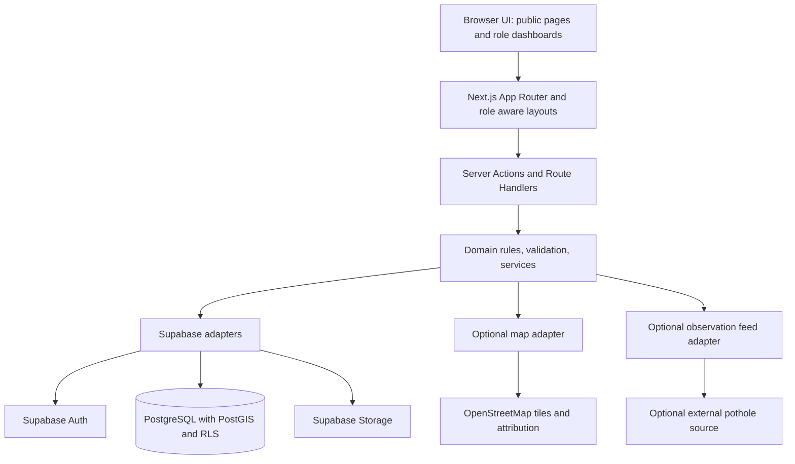

# CivicSync architecture

## System shape

## Layer responsibilities

- **Browser UI (`app/`, `components/`)** renders public pages, forms, maps, and separate Admin, Common People, and Social Service Group workspaces. UI role checks improve clarity but never grant permission.
- **Next.js routes and layouts** provide stable public URLs and route-specific navigation. Protected routes load identity on the server.
- **Server Actions/Route Handlers** are the trust boundary for writes: authenticate, authorize, validate, rate-limit, and call a domain service. No service-role credential belongs in browser code.
- **Domain (`lib/domain`, `lib/services`, `lib/validation`)** owns shared status vocabulary and business rules. Issue verification, official review, group task completion, community confirmation, project completion, and restoration approval remain separate decisions.
- **Supabase adapters (`lib/supabase`)** encapsulate Auth, Postgres, and Storage access. Demo records are local fixtures and do not masquerade as persisted records.
- **Postgres/PostGIS/RLS** stores the authoritative records and enforces access even if a client bypasses the UI. Storage buckets should use private originals and explicitly published, sanitized evidence copies.

## Roles and data flows

The only primary roles are `admin`, `common`, and `group`. Sponsors use Common People accounts. Pending group applications cannot accept work; only approved group members can manage group activity. Admin scopes constrain government actions by department or geography. Public reads expose published project/group information, public issue fields, and counts without reporter identity. Official review history is private to authorized staff; publish only appropriate public responses.

Common People submit observations and may personally verify an issue once. A count expresses independent community observations, never truth. Admins review the issue, its evidence, duplicate suggestions, and project matches as separate decisions. Approved groups may take suitable work and publish progress/completion evidence. Eligible Common People separately confirm or dispute a group completion claim. No group action closes an official issue; no project completion closes unrelated issues.

## Integrations and limits

Supabase is the system of record. OpenStreetMap is an optional basemap; show attribution and keep reporting useful without tiles. Pothole detector/external feeds are optional adapters and imported records remain candidate observations with source and observation time. This demo map is a location preview, not a live OSM map or routing service. No live traffic, government system, messaging, or payment integration is implemented. Sponsorship pledges are simulated and cannot move money.

## Parallel work

Shared types, status names, schemas, service signatures, layouts, migrations, and Supabase clients are owned centrally. Teammate 1 owns `app/admin/` and `components/admin/`; teammate 2 owns public/Common People routes and `components/people/`; teammate 3 owns `app/groups/` and `components/groups/`. Coordinate shared API changes first, use separate branches, and avoid simultaneous edits to migration or global layout files.
